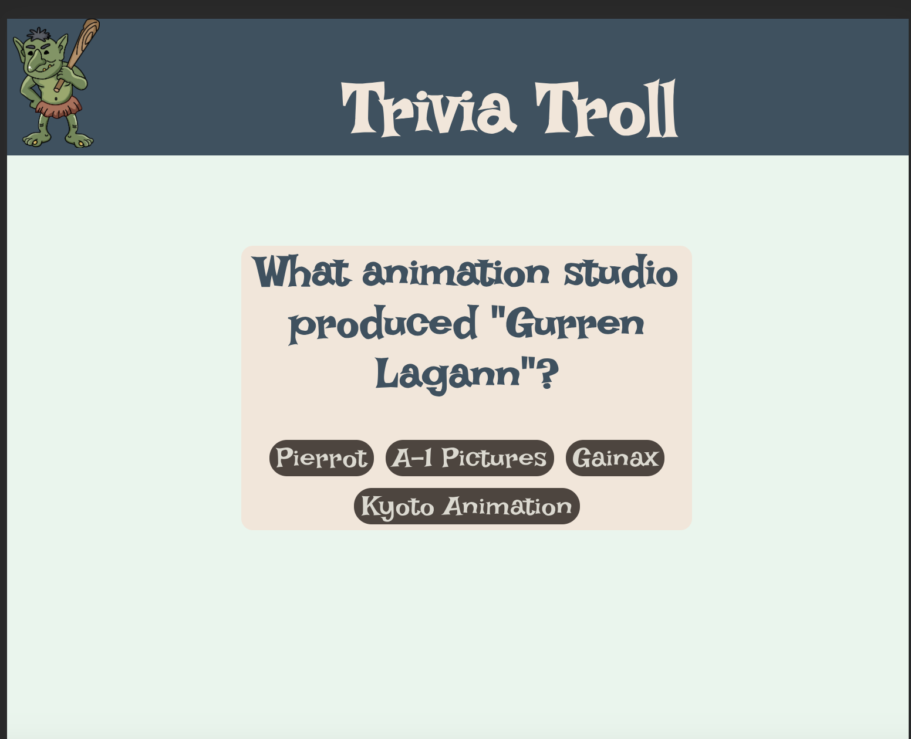

<h1 align=center> ❓ Trivia Troll ❓<h1> 

 

<a href="https://trivia-troll.vercel.app/" style="font-size: 30px;">Deployed Link</a>

## 🧑‍💻 👩🏻‍💻 🧑🏻‍💻 Contributors 
 
[Ben Rosner](https://github.com/ben-rosner-williamsburg)
[Jen Nguyen](http://github.com/jnguyen615)
[William Lavery](https://github.com/wlavery22)

## 📂 Tech Stack 

## 📚 Table of Contents

- [Overview](#overview)
- [Getting Started](#getting-started)
- [Preview](#preview)
- [Wins](#wins)
- [Future Ideas](#future-ideas)

<h2  id="overview">🌐 Overview </h2>

*Trivia troll is a user friendly trivia game letting users answer questions to make it across the troll bridge!*

<h2  id="getting-started">🗂️ Getting Started </h2>

1. Fork or clone down this respository. 
2. In the terminal, open this app by running the command `cd <project folder name>`
3. Run the command  `npm install` to install dependencies.
4. Run the command `npm start` to start the server.
5. Open [http://localhost:3000](http://localhost:3000) to view it in your browser.
6. You can also view the project <a href="https://trivia-troll.vercel.app/">here</a>.
7. Use control C to stop the server.
8. To test, run the command `npm run cypress`.

<h2  id="preview"> 🎥 Preview 📱 </h2>

📱 Mobile and Tablet Views 
Mobile:

Tablet: 

 <h2 id="challenges">💪🏻 Challenges </h2>

💪🏻 Learning a new tech and implementing it in a short period of time 

💪🏻 Implementing responsive design

💪🏻 Having to convert unicode to text that can be read 

<h2 id="wins">🏆 Wins </h2>

 🏆 Learning and implementing typescript 
  
 🏆 Getting a better understanding of Cypress.

 🏆 Figuring out repsonsive design

 🏆 Getting a better understanding of React

 🏆 Incorporating SASS variables for styles 

<h2 id="future-ideas">💡 Future Ideas </h2>

🔮 Filter by category 

🔮 Set the amount of questions 

🔮 Progressive difficulty